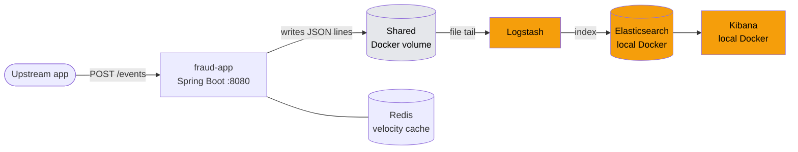
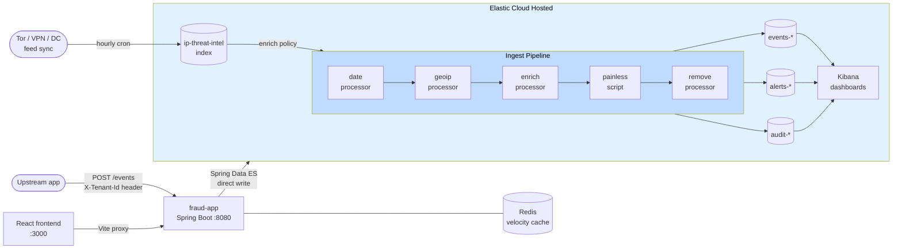
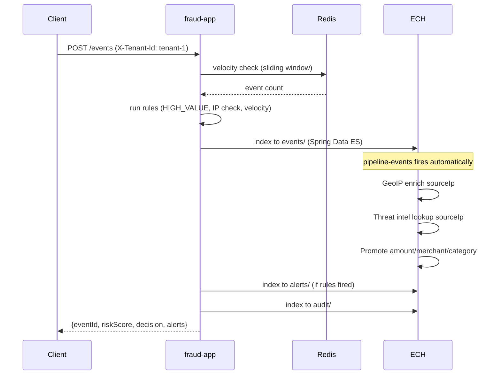
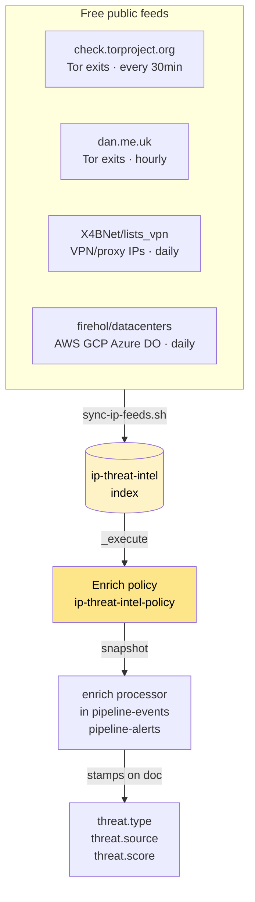

# Fraud Platform — ECH Deployment (`feature/ech-ingest-pipeline`)

This branch migrates the fraud platform from a self-hosted Elasticsearch + Logstash stack to **Elastic Cloud Hosted (ECH)** with native ingest pipelines. The result is a simpler, more secure architecture with fewer moving parts and zero log file polling.

---

## Architecture

### Before (master)



### After (this branch)



### Request flow



### IP threat intel enrichment flow



Logstash, the shared Docker volume, and the local Elasticsearch/Kibana containers are all removed. The app writes directly to ECH via Spring Data Elasticsearch.

### New files

| File | Purpose |
|---|---|
| `src/main/java/com/example/fraud/pipeline/ElasticsearchEventPublisher.java` | Writes events, alerts, and audit records directly to ECH |
| `elasticsearch/pipelines/pipeline-events.json` | Ingest pipeline: GeoIP + threat intel enrichment + field promotion |
| `elasticsearch/pipelines/pipeline-alerts.json` | Ingest pipeline: GeoIP + threat intel enrichment |
| `elasticsearch/pipelines/pipeline-audit.json` | Ingest pipeline: timestamp normalisation |
| `elasticsearch/pipelines/pipeline-applogs.json` | Ingest pipeline: MDC field hoisting |
| `scripts/init-templates.sh` | One-time ECH setup: pipelines, enrich policy, ILM, templates, role |
| `scripts/init-ilm.sh` | ILM policies: events 90d, alerts 180d, audit 7yr |
| `scripts/sync-ip-feeds.sh` | Hourly IP threat feed sync (Tor, VPN, datacenter) |

### Modified files

| File | Change |
|---|---|
| `src/main/java/com/example/fraud/api/EventController.java` | Dual-writes to ECH and log files |
| `src/main/java/com/example/fraud/api/EventControllerTest.java` | Updated for new publisher constructor |
| `src/main/java/com/example/fraud/event/EventDocument.java` | Added `@Field(type=Date)` on `eventTime` |
| `src/main/java/com/example/fraud/fraud/AlertDocument.java` | Added `@Field(type=Date)` on `detectedAt` |
| `src/main/java/com/example/fraud/fraud/FraudAlert.java` | Added `@Field(type=Date)` on `detectedAt` |
| `src/main/java/com/example/fraud/audit/AuditEntry.java` | Added `@Field(type=Date)` on `evaluatedAt` |
| `src/main/java/com/example/fraud/config/WebConfig.java` | CORS opened to `allowedOriginPatterns("*")` |
| `frontend/vite.config.ts` | Added proxy config + Tailwind plugin |
| `frontend/src/lib/api.ts` | Fixed `API_BASE` and `TENANT_ID` defaults |
| `docker-compose.yml` | Removed ES/Kibana/Logstash containers, added ECH env vars |
| `elasticsearch/templates/*.json` | Added `default_pipeline`, `_class` field, strict mappings, ILM refs |

---

## Prerequisites

- Docker + Docker Compose
- An Elastic Cloud account with a deployment (ECH)
- The `elastic` superuser password for initial setup

---

## Deployment

### 1. Configure credentials

```bash
cp .env.example .env
nano .env
```

```
ES_HOST=https://your-cluster.es.us-east-2.aws.elastic-cloud.com
ES_USERNAME=elastic
ES_PASSWORD=your-password
REDIS_PASSWORD=choose-a-strong-password
GEOIP_DB_PATH=
```

### 2. One-time ECH setup

```bash
bash scripts/init-templates.sh
```

This runs in order:
1. Loads 4 ingest pipelines into ECH
2. Creates the `ip-threat-intel` index + seed doc
3. Creates and executes the enrich policy
4. Creates ILM policies (events 90d, alerts 180d, audit 7yr compliance)
5. Loads all index templates (each wired to its `default_pipeline`)
6. Creates the `fraud_app_role` in ECH security

### 3. Create a service account (recommended)

In Kibana → Stack Management → Users → Create user:
- Username: `fraud-app-svc`
- Role: `fraud_app_role`

Then update `.env` to use `fraud-app-svc` instead of `elastic`.

### 4. Load IP threat feeds

```bash
bash scripts/sync-ip-feeds.sh
```

Pulls free public threat intelligence feeds into `ip-threat-intel`:

| Feed | Type | Score | Update frequency |
|---|---|---|---|
| check.torproject.org | Tor exit nodes | 85 | Every 30 min |
| dan.me.uk | Tor exit nodes | 85 | Hourly |
| X4BNet/lists_vpn | VPN/proxy IPs | 65 | Daily |
| firehol/datacenters.netset | Datacenter IPs | 40 | Daily |

### 5. Schedule hourly feed refresh

```bash
# Add to crontab
0 * * * * cd /path/to/fraud-platform && bash scripts/sync-ip-feeds.sh >> /var/log/ip-feed-sync.log 2>&1
```

### 6. Start the stack

```bash
docker compose up -d
```

Services started: `redis`, `fraud-app`, `frontend`

### 7. Seed test data

```bash
bash scripts/seed-data.sh
```

---

## How ingest pipelines work

Every document written to ECH automatically triggers the index's `default_pipeline`:

```
fraud-app writes event → events index
  ↓ pipeline-events fires
  ├── date processor      → @timestamp from eventTime
  ├── geoip processor     → geoip.country_name / city_name / location
  ├── enrich processor    → threat.type / threat.source / threat.score
  ├── painless script     → promotes attributes.amount/merchant/category to top level
  └── remove processor    → strips host/log/agent/@version
```

The enrich processor looks up `sourceIp` against the `ip-threat-intel` index snapshot. After each `sync-ip-feeds.sh` run the policy is re-executed to refresh the snapshot with new threat data.

### Simulating a pipeline (useful for debugging)

```bash
source .env
curl -u "$ES_USERNAME:$ES_PASSWORD" \
  -X POST "$ES_HOST/_ingest/pipeline/pipeline-events/_simulate" \
  -H "Content-Type: application/json" \
  -d '{
    "docs": [{
      "_source": {
        "id": "test-001",
        "tenantId": "tenant-1",
        "eventType": "purchase",
        "customerId": "cust-001",
        "sourceIp": "185.220.101.1",
        "eventTime": "2026-06-23T10:00:00Z",
        "attributes": {"amount": 500, "merchant": "TestShop", "category": "retail"}
      }
    }]
  }'
```

---

## Index lifecycle

| Index | Hot | Warm | Delete |
|---|---|---|---|
| `events-*` | 30 days / 10GB | forcemerge | 90 days |
| `alerts-*` | 30 days | forcemerge | 180 days |
| `audit-*` | 30 days | read-only | 7 years (compliance) |

---

## ECH security checklist

- [ ] Reset `elastic` superuser password after initial setup
- [ ] Create `fraud-app-svc` service account with `fraud_app_role`
- [ ] `.env` added to `.gitignore` — never commit credentials
- [ ] Redis password set in `.env`
- [ ] ECH Traffic Filter: allowlist your server's IP in Elastic Cloud console
- [ ] Hourly cron for `sync-ip-feeds.sh` configured

---

## ECH vs master comparison

| | master | this branch |
|---|---|---|
| ES location | Local Docker container | Elastic Cloud Hosted |
| Log shipping | Logstash file tail | Direct Spring Data ES writes |
| GeoIP enrichment | Logstash geoip filter | ECH ingest pipeline |
| Threat intel | Hardcoded YAML list | Live feed → enrich policy |
| Index templates | No `default_pipeline` | Wired to ingest pipelines |
| Data retention | Manual / none | ILM policies |
| Security | `xpack.security=false` | ECH managed TLS + auth |
| Containers | 6 (ES, Kibana, Logstash, Redis, app, frontend) | 3 (Redis, app, frontend) |
